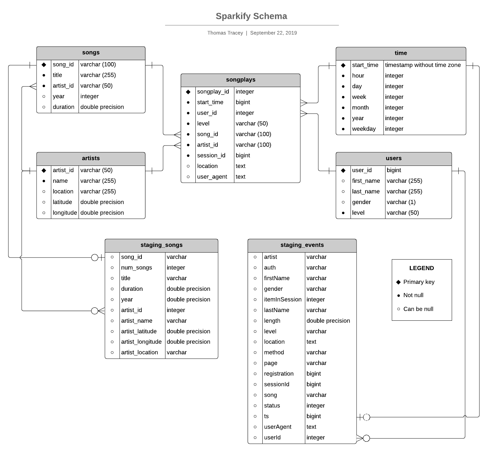
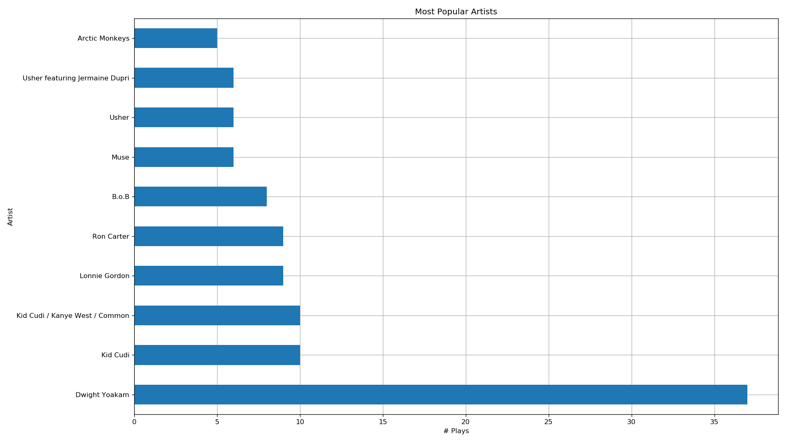
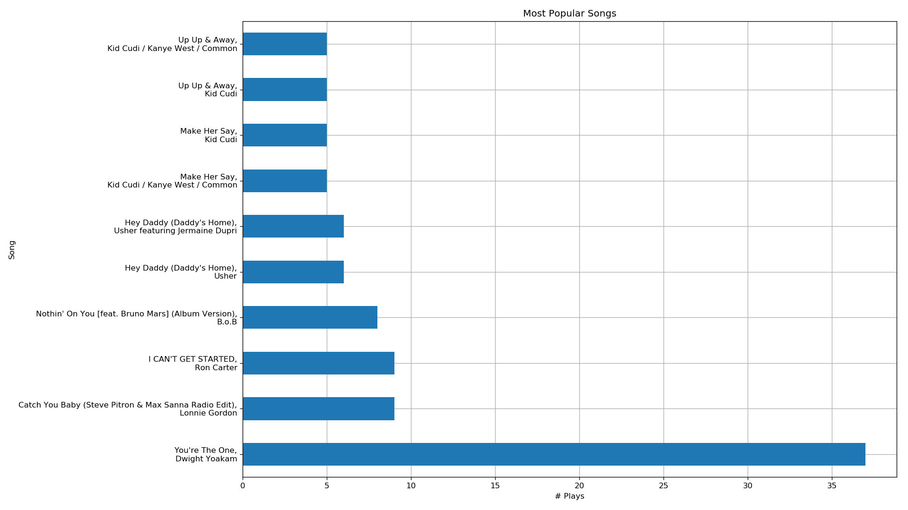
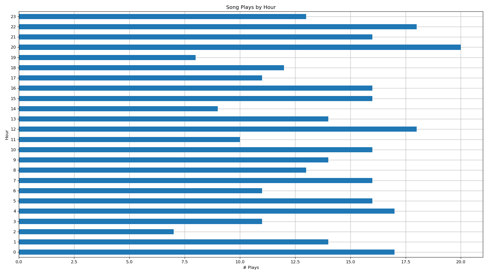
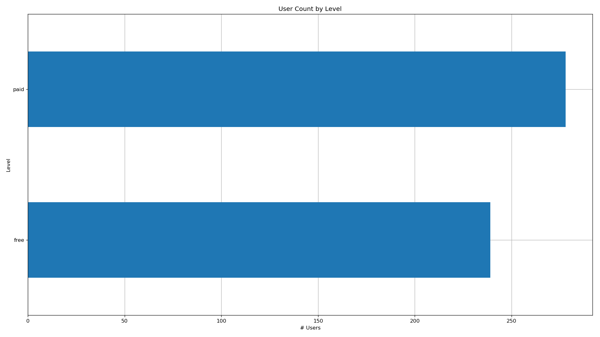
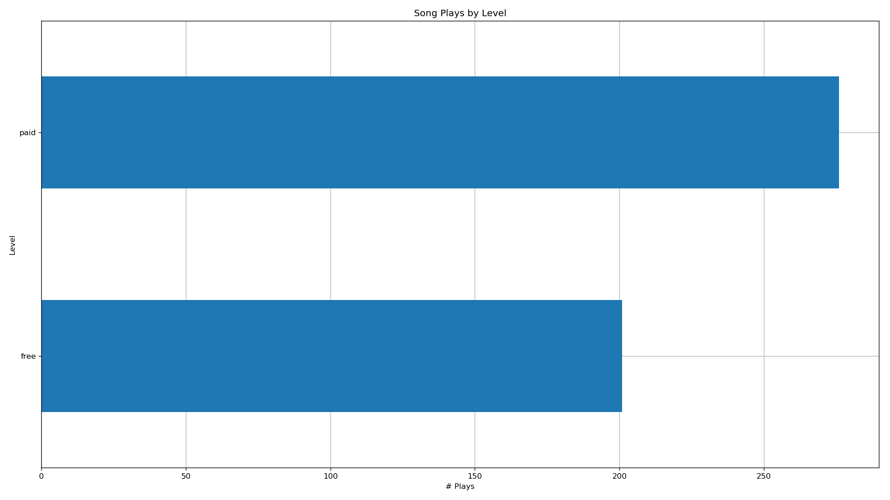
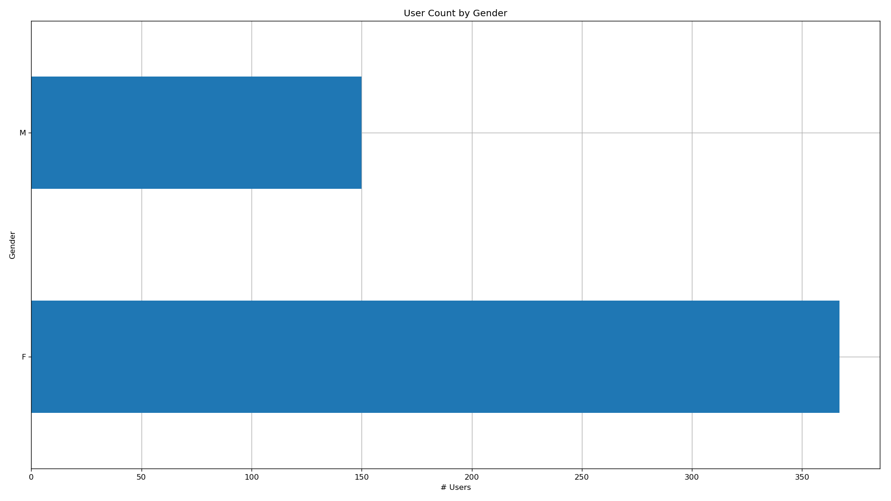
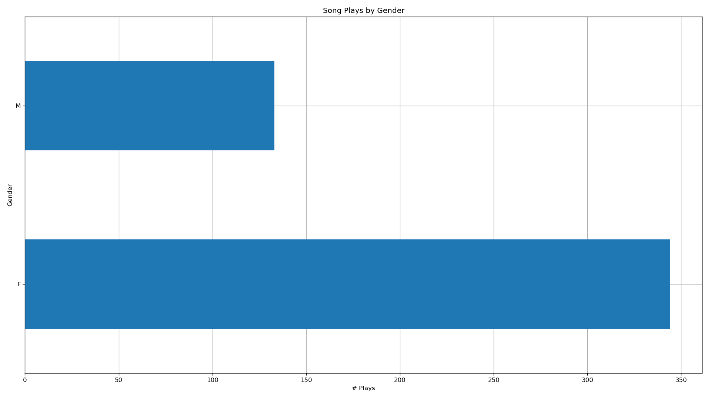
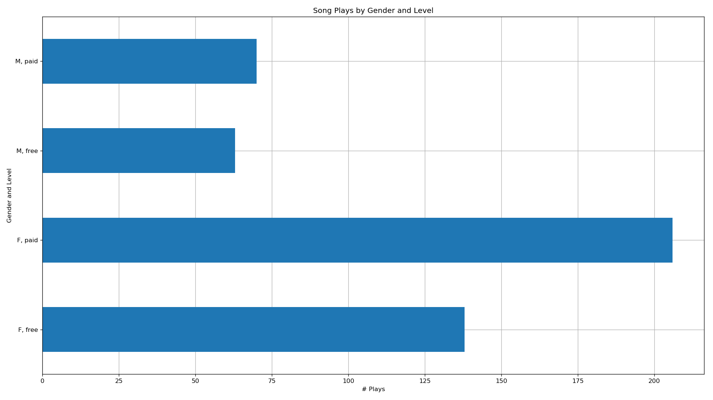
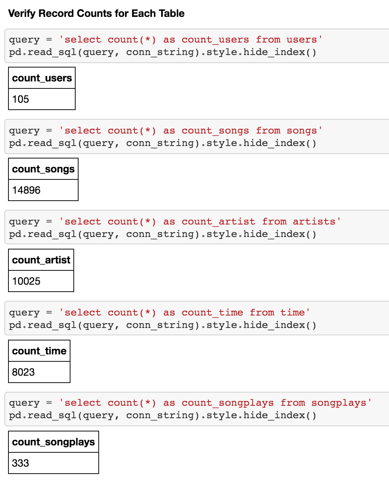

### Udacity Data Engineering Nanodegree
# Project 3: Create a Data Warehouse in Amazon Redshift


##### &nbsp;


For instructions on how to setup and run this project, jump to the ['Running the Project'](https://github.com/tommytracey/udacity_data_engineering/tree/master/p3_data_warehouse_redshift#running-the-project) section.

##### &nbsp;

<!--
The write-up below is also available [here as a blog post](https://medium.com/@thomastracey/training-two-agents-to-play-tennis-8285ebfaec5f). ##### &nbsp;
-->

## Introduction
A music streaming startup, Sparkify, has grown their user base and song database and want to move their processes and data onto the cloud. Their data resides in S3, in a directory of JSON logs on user activity on the app, as well as a directory with JSON metadata on the songs in their app.

Sparkify needs a data engineer to create an ETL pipeline that extracts their data from S3, stages them in Redshift, and transforms the data into a set of dimensional tables. This will allow their analytics team to gain insights into what songs their users are listening to.

As the data engineer, it is our job to create the ETL pipeline and data warehouse to support this analysis. We'll test our implementation by running queries from the Sparkify analytics team and compare their expected results with our results.


##### &nbsp;

## Goals
In this project, we apply what we've learned on data warehouses and AWS to build an ETL pipeline for a database hosted on Redshift.

To complete the project, we need to:
1. Load data from S3 to staging tables in Redshift
2. Execute SQL statements that create the analytics tables from these staging tables.


##### &nbsp;

## Project Scope

##### &nbsp;

### Datasets
For this project, you'll be working with two datasets that reside in S3. Here are the S3 links for each:

- Song data: `s3://udacity-dend/song_data`
- Log data: `s3://udacity-dend/log_data`
  - Log data json path: `s3://udacity-dend/log_json_path.json`

#### Song Dataset
The first dataset is a subset of real data from the [Million Song Dataset](https://labrosa.ee.columbia.edu/millionsong/). Each file is in JSON format and contains metadata about a song and the artist of that song. The files are partitioned by the first three letters of each song's track ID. For example, here are filepaths to two files in this dataset.

`song_data/A/B/C/TRABCEI128F424C983.json`
`song_data/A/A/B/TRAABJL12903CDCF1A.json`

And below is an example of what a single song file, `TRAABJL12903CDCF1A.json`, looks like.

```
{"num_songs": 1, "artist_id": "ARJIE2Y1187B994AB7", "artist_latitude": null, "artist_longitude": null, "artist_location": "", "artist_name": "Line Renaud", "song_id": "SOUPIRU12A6D4FA1E1", "title": "Der Kleine Dompfaff", "duration": 152.92036, "year": 0}
```

#### Log Dataset
The second dataset consists of log files in JSON format generated by this [event simulator](https://github.com/Interana/eventsim) based on the songs in the dataset above. These simulate app activity logs from an imaginary music streaming app based on configuration settings.

The log files in the dataset you'll be working with are partitioned by year and month. For example, here are filepaths to two files in this dataset.

`log_data/2018/11/2018-11-12-events.json`
`log_data/2018/11/2018-11-13-events.json`

Below is an example of what the data in a log file, `2018-11-12-events.json`, looks like.


##### &nbsp;

### Implementation Steps
Below are steps taken to build each component of this project.

#### Create Table Schemas
1. Design schemas for your fact and dimension tables
1. Write a SQL CREATE statement for each of these tables in sql_queries.py
1. Complete the logic in create_tables.py to connect to the database and create these tables
1. Write SQL DROP statements to drop tables in the beginning of create_tables.py if the tables already exist. This way, you can run create_tables.py whenever you want to reset your database and test your ETL pipeline.
1. Launch a redshift cluster and create an IAM role that has read access to S3.
1. Add redshift database and IAM role info to dwh.cfg.
1. Test by running create_tables.py and checking the table schemas in your redshift database. You can use Query Editor in the AWS Redshift console for this.

#### Build ETL Pipeline
1. Implement the logic in etl.py to load data from S3 to staging tables on Redshift.
1. Implement the logic in etl.py to load data from staging tables to analytics tables on Redshift.
1. Test by running etl.py after running create_tables.py and running the analytic queries on your Redshift database to compare your results with the expected results.
1. Delete your redshift cluster when finished.


##### &nbsp;
---

## My Implementation


### Running the Project
Here are the steps to run my implementation of this project:

1. Create a python environment with the dependencies listed in `requirements.txt` (or `requirements_full.txt` for the complete set of packages).
  - _Tip: Here is a great tool called [pipreqs](https://github.com/bndr/pipreqs). With pipreqs you can export a dependencies file  that only contains the set of packages imported in the project code. Much cleaner than using_ `pip freeze`.

1. Add your AWS keys to `dwh.cfg` in the project root folder.

1. Create a data warehouse cluster in AWS Redshift:
`$ python create_cluster.py` The new cluster endpoint and ARN are automatically saved to `dwh.cfg`.

1. Create the Postgres tables:
`$ python create_tables.py`

1. Extract data from source files and load it into the datawarehouse tables:
`$ python etl.py`

1. Run test queries and create visualizations for data analysis (done via the notebook [`analytic_queries.ipynb`](analytic_queries.ipynb)).

1. Delete the cluster: `$ python delete_cluster.py`


##### &nbsp;

### Schema for Song Play Analysis
Using the song and event datasets, here is a star schema optimized for queries on song play analysis. This includes the following tables.

##### &nbsp;

#### Fact Table
- **songplays** &mdash; records in event data associated with song plays, i.e. records with `page = NextSong`


#### Dimension Tables
- **users** &mdash; users in the app
- **songs** &mdash; songs in music database
- **artists** &mdash; artists in music database
- **time** &mdash; timestamps of records in songplays broken down into specific units

#### Staging Tables
- **staging_events** &mdash; temporary table for extracting event data from log files
- **staging_songs** &mdash; temporary table for extracting song metadata from source files


##### &nbsp;

#### Schema Diagram




##### &nbsp;

### Query Examples (for song data ETL)

#### 1. Create `staging_songs` table
```sql
CREATE TABLE IF NOT EXISTS staging_songs (
         artist_id VARCHAR,
   artist_latitude FLOAT,
   artist_location VARCHAR(1000),
  artist_longitude FLOAT,
       artist_name VARCHAR(500),
          duration FLOAT,
         num_songs INTEGER,
           song_id VARCHAR,
             title VARCHAR(500),
              year INTEGER
);
```
[view source code](https://github.com/tommytracey/udacity_data_engineering/blob/master/p3_data_warehouse_redshift/sql_queries.py#L47)

#### 2. Create `songs` dimension table
```sql
CREATE TABLE IF NOT EXISTS songs (
    song_id VARCHAR(100) PRIMARY KEY,
      title VARCHAR(255) NOT NULL,
  artist_id VARCHAR(50) NOT NULL REFERENCES artists(artist_id) DISTKEY,
       year INTEGER,
   duration DOUBLE PRECISION
);
```
[view source code](https://github.com/tommytracey/udacity_data_engineering/blob/master/p3_data_warehouse_redshift/sql_queries.py#L74)

#### 3. Load song source data into `staging_songs`
```sql
COPY staging_songs
FROM 's3://udacity-dend/song_data'
CREDENTIALS 'aws_iam_role={config['IAM_ROLE']['arn']}'
REGION 'us-west-2'
FORMAT AS JSON 'auto';
```
[view source code](https://github.com/tommytracey/udacity_data_engineering/blob/master/p3_data_warehouse_redshift/sql_queries.py#L135)

#### 4. Load song data from `staging_songs` table to `songs` dimension table
```sql
INSERT INTO songs (song_id, title, artist_id, year, duration)
SELECT DISTINCT song_id,
                title,
                artist_id,
                year,
                duration
FROM staging_songs
WHERE song_id IS NOT NULL;
```
[view source code](https://github.com/tommytracey/udacity_data_engineering/blob/master/p3_data_warehouse_redshift/sql_queries.py#L156)

##### &nbsp;

A complete set of queries is available in [sql_queries.py](sql_queries.py).


##### &nbsp;

### Analysis
The following graphs provide some insight into user behavior and the most popular artists and songs on Sparkify. The source code and steps taken to generate this analysis is available in the notebook [`analytic_queries.ipynb`](analytic_queries.ipynb).

#### Summary of Key Insights
1. Sparkify has more paid users than free users. This is surprising as usually apps have an order of magnitude more free users than paid users.
1. Sparkify has more than 2x as many female users than male users. And, in line with this ratio, female users generate more than 2/3 of the songplays.
1. The most popular artist and song &mdash; Dwight Yoakam, _You're The One_ &mdash; have more than 3x the number of songplays as any other artist or song.
1. Users seem to listen to music at roughly the same frequency throughout the day.

##### &nbsp;

#### Graphs



##### &nbsp;



##### &nbsp;



##### &nbsp;



##### &nbsp;



##### &nbsp;



##### &nbsp;



##### &nbsp;



##### &nbsp;



##### &nbsp;
