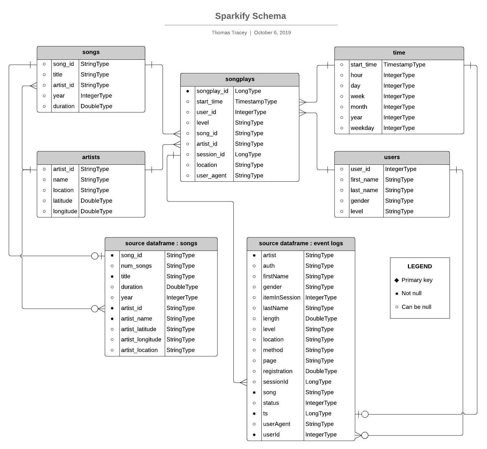
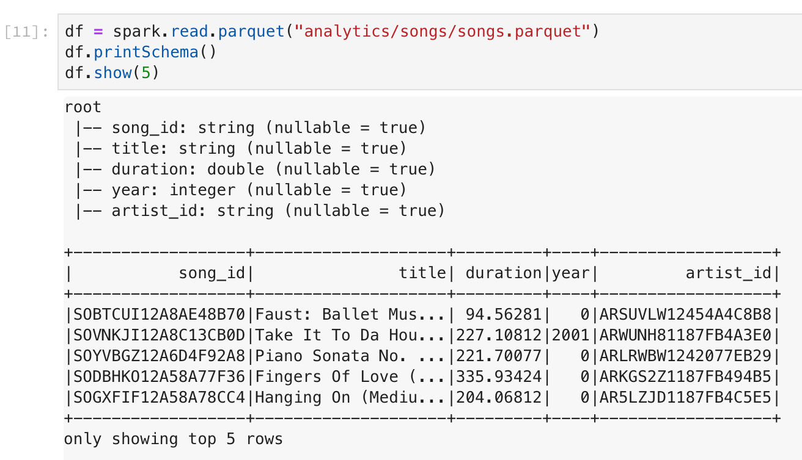

### Udacity Data Engineering Nanodegree
# Project 4: Data Lakes with Apache Spark


##### &nbsp;


For instructions on how to setup and run this project, jump to the ['Running the Project'](https://github.com/tommytracey/udacity_data_engineering/tree/master/p4_data_lake_spark#running-the-project) section.
##### &nbsp;


## Introduction
A music streaming startup, Sparkify, has grown their user base and song database even more and want to move their data warehouse to a data lake. Their data resides in S3, in a directory of JSON logs on user activity on the app, as well as a directory with JSON metadata on the songs in their app.

As their data engineer, you are tasked with building an ETL pipeline that extracts their data from S3, processes them using Spark, and loads the data back into S3 as a set of dimensional tables. This will allow their analytics team to continue finding insights in what songs their users are listening to.


##### &nbsp;

## Goals
In this project, we apply what we've learned on Spark and data lakes to build an ETL pipeline for a data lake hosted on S3. We'll deploy this Spark process on a cluster using AWS.

To complete the project, we need to:

1. Load source data from S3
1. Process the data into analytics tables using Spark
1. Load the processed data back into S3

##### &nbsp;


## Project Scope

##### &nbsp;

### Datasets
For this project, you'll be working with two datasets that reside in S3. Here are the S3 links for each:

- Song data: `s3://udacity-dend/song_data`
- Log data: `s3://udacity-dend/log_data`
  - Log data json path: `s3://udacity-dend/log_json_path.json`

#### Song Dataset
The first dataset is a subset of real data from the [Million Song Dataset](https://labrosa.ee.columbia.edu/millionsong/). Each file is in JSON format and contains metadata about a song and the artist of that song. The files are partitioned by the first three letters of each song's track ID. For example, here are filepaths to two files in this dataset.

`song_data/A/B/C/TRABCEI128F424C983.json`
`song_data/A/A/B/TRAABJL12903CDCF1A.json`

And below is an example of what a single song file, `TRAABJL12903CDCF1A.json`, looks like.

```
{"num_songs": 1, "artist_id": "ARJIE2Y1187B994AB7", "artist_latitude": null, "artist_longitude": null, "artist_location": "", "artist_name": "Line Renaud", "song_id": "SOUPIRU12A6D4FA1E1", "title": "Der Kleine Dompfaff", "duration": 152.92036, "year": 0}
```

#### Log Dataset
The second dataset consists of log files in JSON format generated by this [event simulator](https://github.com/Interana/eventsim) based on the songs in the dataset above. These simulate app activity logs from an imaginary music streaming app based on configuration settings.

The log files in the dataset you'll be working with are partitioned by year and month. For example, here are filepaths to two files in this dataset.

`log_data/2018/11/2018-11-12-events.json`
`log_data/2018/11/2018-11-13-events.json`

Below is an example of what the data in a log file, `2018-11-12-events.json`, looks like.


##### &nbsp;

### Project Rubrik
Below are Udacity's criteria for completing this project.

#### ETL
1. Deploy this Spark process on a cluster using AWS.
1. The script, etl.py, runs in the terminal without errors. The script reads song_data and load_data from S3, transforms them to create five different tables, and writes them to partitioned parquet files in table directories on S3.
1. Each of the five tables are written to parquet files in a separate analytics directory on S3. Each table has its own folder within the directory. Songs table files are partitioned by year and then artist. Time table files are partitioned by year and month. Songplays table files are partitioned by year and month.
1. Each table includes the right columns and data types. Duplicates are addressed where appropriate.

#### Code Quality
1. The README file includes a summary of the project, how to run the Python scripts, and an explanation of the files in the repository. Comments are used effectively and each function has a docstring.
1. Scripts have an intuitive, easy-to-follow structure with code separated into logical functions. Naming for variables and functions follows the PEP8 style guidelines.


##### &nbsp;

---

## My Implementation

##### &nbsp;

### Running the Project
Here are the steps to run my implementation of this project:

1. Create your own S3 bucket and Amazon EMR cluster with the dependencies listed in `requirements.txt`.
    - Or, if you're a student in Udacity's Data Engineering Nanodegree (DEND) program, you can use the project workspace.

1. Add your AWS keys to `dl.cfg` in the project root folder. Do not enclose your key values in quotes.

1. Update the data paths within the `main()` function in `etl.py`. These paths should point to the input and output directories you are using.
   - A subset of the input data can be found in the `/data` directory.

1. Run the ETL process:
`$ python etl.py`

1. Examine your output data directory to verify the data is properly partitioned and stored in parquet format.
    - A sample of my output can be found in the `/analytics` directory.

1. Run a few Spark queries on the parquet output files to verify the tables are structured correctly and populated with data. This can be done via the notebook [`test-outputs.ipynb`](test-outputs.ipynb).

1. Delete your AWS cluster and S3 bucket (if needed). This must be done manually.


##### &nbsp;

### Schema for Song Play Analysis
Using the song and event datasets, here is a star schema designed to support song play analysis.

#### Fact Table
- **songplays** &mdash; records in event data associated with song plays, i.e. records with `page = NextSong`

#### Dimension Tables
- **users** &mdash; users in the app
- **songs** &mdash; songs in music database
- **artists** &mdash; artists in music database
- **time** &mdash; timestamps of records in songplays broken down into specific units

#### Schema Diagram




##### &nbsp;

### Spark Query Example



_view all table queries in [test-outputs.ipynb](test-outputs.ipynb)_
